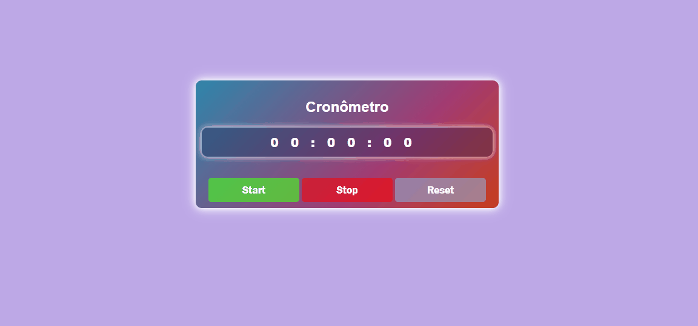

# Projetinho com Cronômetro

<h1>
    
</h1>

<h1 align="center">
<a href="https://wellington-div.github.io/cronometro/"  style="text-decoration:none">Teste aqui</a>
</h1>
 
---

## Sobre

Esse projeto foi feito por desafios de colegas. 

---
## Tecnologias utilizadas

- html
- css 
- javascript
